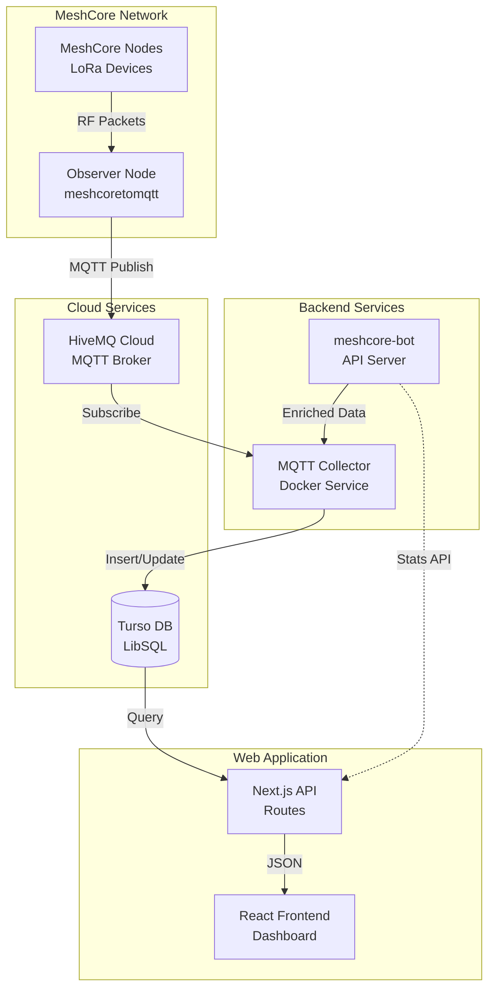
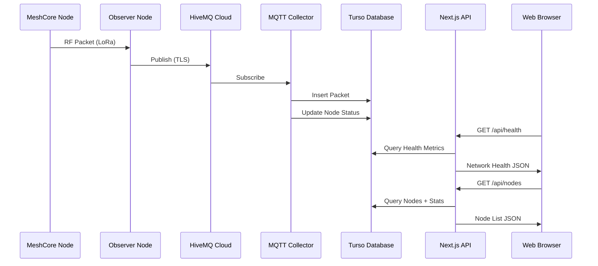

# Denver MeshCore

Colorado's decentralized mesh network community platform. Real-time monitoring, interactive maps, and community integration for the Denver MeshCore network.

## Overview

Denver MeshCore is a community-driven platform that provides real-time visibility into Colorado's growing mesh network. The platform collects data from MeshCore nodes via MQTT, processes it through a dedicated collector service, and presents it through an interactive web dashboard.

### Key Features

- **Real-time Network Health** - 10-component scoring system with live metrics
- **Interactive Network Map** - Leaflet-based map showing all nodes with geolocation
- **Community Statistics** - Track messages, contacts, hop counts, and more
- **Observer Dashboard** - Detailed view of network performance and top contributors
- **Bot Integration** - Direct integration with meshcore-bot for enriched data

## System Architecture



## Data Flow



## Tech Stack

| Layer | Technology | Purpose |
|-------|------------|---------|
| **Frontend** | Next.js 16, React 19 | Server-side rendering, routing |
| **Styling** | TailwindCSS 4 | Utility-first CSS framework |
| **Maps** | Leaflet, react-leaflet | Interactive network visualization |
| **Database** | Turso (LibSQL) | Edge-distributed SQLite |
| **Data Collection** | MQTT Collector (Docker) | Real-time packet ingestion |
| **MQTT Broker** | HiveMQ Cloud | Managed message broker |
| **External API** | meshcore-bot | Node enrichment, GPS coordinates |
| **Deployment** | Netlify (web), Docker (collector) | Production hosting |

## Quick Start

### Prerequisites

- Node.js 20 or later
- npm, pnpm, or yarn
- Turso account (for database)
- Access to HiveMQ Cloud (for MQTT collector)

### Installation

1. **Clone the repository:**
   ```bash
   git clone https://github.com/Denver-MeshCore/denvermc.git
   cd denvermc
   ```

2. **Install dependencies:**
   ```bash
   npm install
   ```

3. **Configure environment variables:**
   ```bash
   cp .env.example .env.local
   ```

   Edit `.env.local` with your credentials (see [Environment Variables](#environment-variables)).

4. **Run the development server:**
   ```bash
   npm run dev
   ```

5. **Open the application:**

   Navigate to [http://localhost:3000](http://localhost:3000)

### Build for Production

```bash
npm run build
npm start
```

## Documentation

Detailed documentation is distributed throughout the codebase:

| Document | Description |
|----------|-------------|
| [API Reference](src/app/api/README.md) | REST API endpoints, response formats, caching |
| [Database Schema](src/lib/db/README.md) | Entity relationships, query functions, types |
| [Components](src/components/README.md) | React component library, hooks, styling |
| [MQTT Collector](services/mqtt-collector/README.md) | Data ingestion, Docker deployment, message formats |

## Environment Variables

### Web Application

| Variable | Required | Description |
|----------|----------|-------------|
| `TURSO_DATABASE_URL` | Yes | Turso database URL (`libsql://...`) |
| `TURSO_AUTH_TOKEN` | Yes | Turso authentication token |
| `BOT_API_URL` | No | meshcore-bot API endpoint for enriched stats |
| `CF_ACCESS_CLIENT_ID` | No | Cloudflare Access client ID (for bot API auth) |
| `CF_ACCESS_CLIENT_SECRET` | No | Cloudflare Access client secret |

### MQTT Collector (Docker)

| Variable | Required | Description |
|----------|----------|-------------|
| `MQTT_BROKER_URL` | Yes | HiveMQ cluster hostname |
| `MQTT_PORT` | No | MQTT port (default: 8883) |
| `MQTT_USERNAME` | Yes | HiveMQ authentication username |
| `MQTT_PASSWORD` | Yes | HiveMQ authentication password |
| `TURSO_DATABASE_URL` | Yes | Turso database URL |
| `TURSO_AUTH_TOKEN` | Yes | Turso authentication token |
| `MESHCORE_BOT_API_URL` | No | meshcore-bot API for node enrichment |
| `MESHCORE_BOT_SYNC_INTERVAL` | No | Sync interval in ms (default: 60000) |

## Deployment

### Web Application (Netlify)

The application is configured for Netlify deployment with the `netlify.toml` configuration:

```bash
# Deploy to Netlify
netlify deploy --prod
```

Key features:
- Automatic Next.js runtime detection
- Security headers (HSTS, CSP, XSS protection)
- Static asset caching
- API route configuration

### MQTT Collector (Docker)

```bash
cd services/mqtt-collector
docker-compose up -d --build
```

See [MQTT Collector Documentation](services/mqtt-collector/README.md) for detailed deployment instructions.

## API Overview

| Endpoint | Method | Description | Cache TTL |
|----------|--------|-------------|-----------|
| `/api/health` | GET | Network health with 10-component scoring | 30s |
| `/api/stats` | GET | Community statistics with bot metrics | 60s |
| `/api/nodes` | GET | List all nodes with computed statistics | - |
| `/api/nodes/[id]` | GET | Single node details with packets and daily stats | - |

See [API Reference](src/app/api/README.md) for complete documentation.

## Network Health Scoring

The network health score (0-100) is calculated from 10 weighted components:

| Component | Description | Max Points |
|-----------|-------------|------------|
| Status | Network status + node count | 10 |
| Uptime | System uptime percentage | 10 |
| Signal | Signal-to-noise ratio quality | 10 |
| Activity | Message and contact activity | 10 |
| Responsiveness | Bot response rate | 10 |
| Reach | Multi-hop network depth | 10 |
| Recency | Freshness of last packet | 10 |
| Diversity | Unique active users | 10 |
| Geo Coverage | Geographic spread (km) | 10 |
| Latency | Message response time | 10 |

## Project Structure

```
denvermc/
├── src/
│   ├── app/                    # Next.js App Router
│   │   ├── api/               # API routes
│   │   │   ├── health/        # Network health endpoint
│   │   │   ├── stats/         # Community stats endpoint
│   │   │   └── nodes/         # Node list and details
│   │   ├── map/               # Interactive map page
│   │   ├── observer/          # Observer dashboard
│   │   └── page.tsx           # Home page
│   ├── components/            # React components
│   ├── hooks/                 # Custom React hooks
│   └── lib/                   # Shared utilities
│       ├── db/                # Database layer
│       └── types.ts           # TypeScript types
├── services/
│   └── mqtt-collector/        # MQTT data ingestion service
├── public/                    # Static assets
├── netlify.toml              # Netlify configuration
└── package.json
```

## Community

- **Discord**: [discord.gg/QpaW8FTTCE](https://discord.gg/QpaW8FTTCE)
- **MeshCore**: [meshcore.co.uk](https://meshcore.co.uk)
- **LetsMesh**: [letsmesh.net](https://letsmesh.net)

## Contributing

Contributions are welcome! Please feel free to submit a Pull Request.

## License

This project is part of the Denver MeshCore community initiative.
