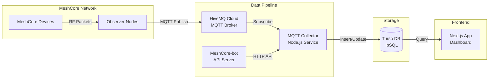
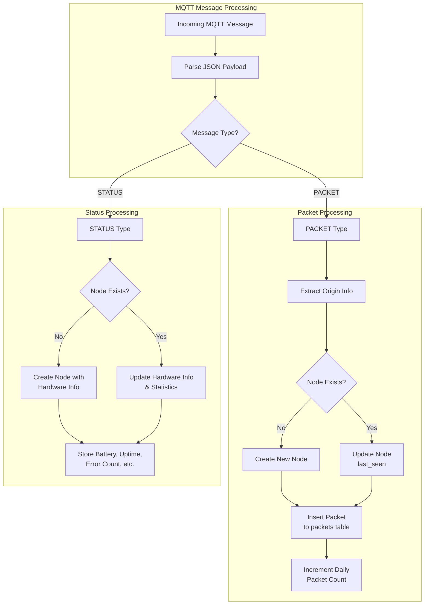
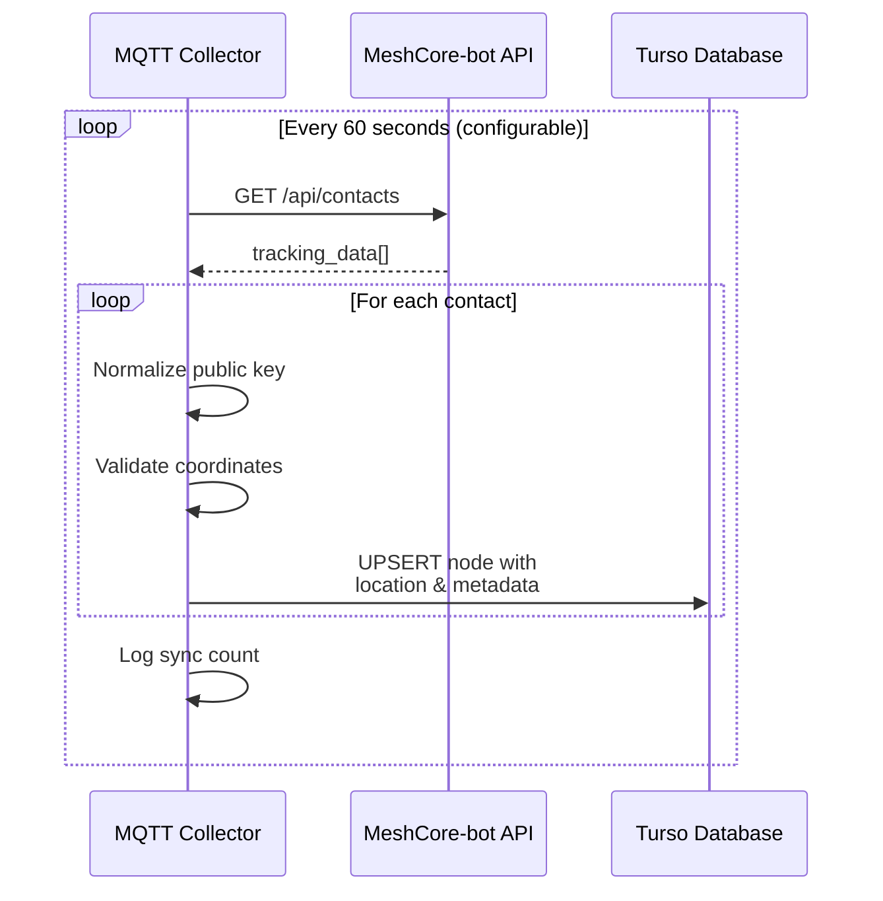
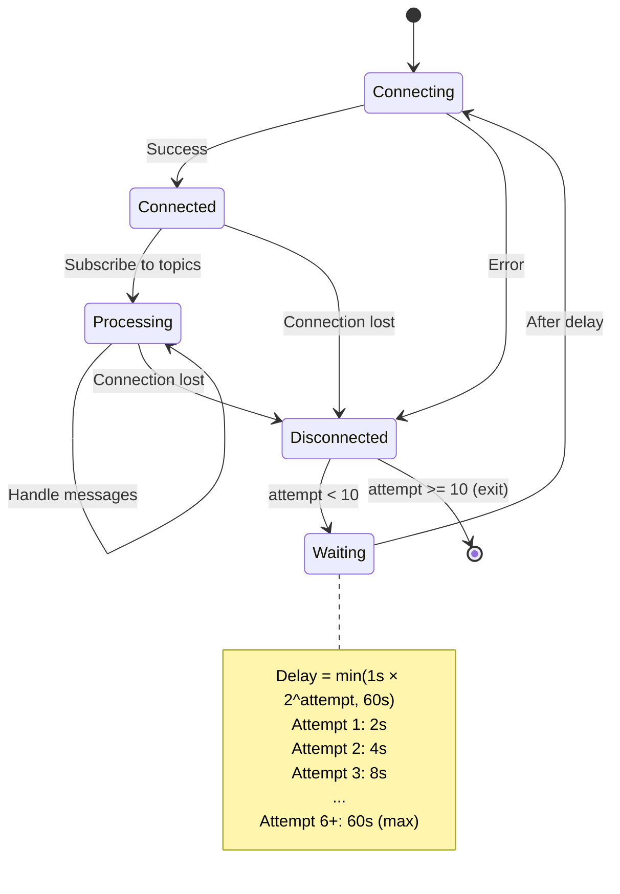
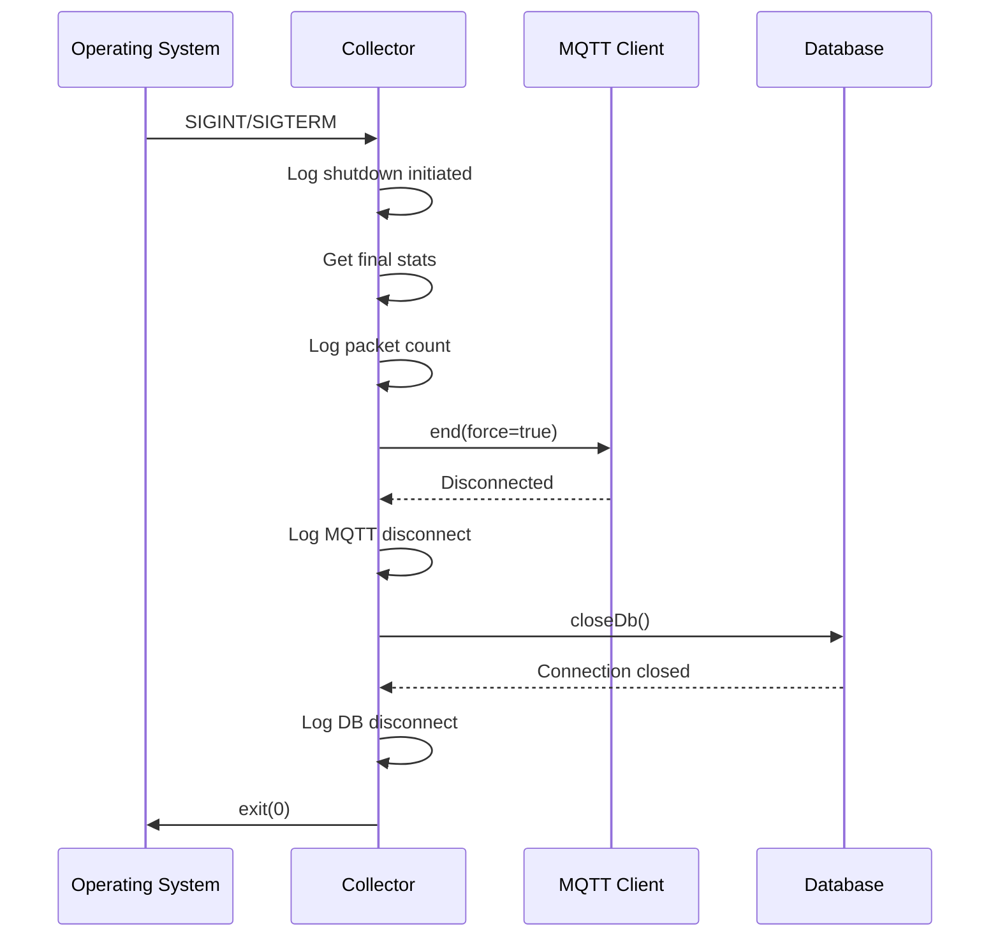

# Denver MeshCore MQTT Collector

A production-ready service that subscribes to MeshCore MQTT topics from HiveMQ Cloud and stores packets in the Turso database. This collector is the backbone of the Denver MeshCore network monitoring infrastructure.

## Architecture Overview

The MQTT Collector acts as the central data ingestion point for the Denver MeshCore network:



### Component Roles

| Component | Role |
|-----------|------|
| **Observer Nodes** | Hardware nodes running `meshcoretomqtt` that capture RF packets and publish to MQTT |
| **HiveMQ Cloud** | Managed MQTT broker providing reliable message delivery with TLS encryption |
| **MQTT Collector** | This service - processes MQTT messages and stores them in the database |
| **MeshCore-bot API** | Companion service providing enriched node data (coordinates, parsed ADVERTs) |
| **Turso DB** | Edge-distributed SQLite database for packet and node storage |
| **Next.js App** | Web dashboard displaying network statistics and node information |

## Packet Handling Flow

The collector processes two types of MQTT messages: packets and status updates.



## Topic Subscription Patterns

The collector subscribes to wildcard MQTT topics to capture all network traffic:

| Topic Pattern | Purpose | Example Match |
|---------------|---------|---------------|
| `meshcore/+/+/packets` | Packet data with RF metrics | `meshcore/DEN/ABC123/packets` |
| `meshcore/+/+/status` | Node online/offline status | `meshcore/DEN/ABC123/status` |
| `meshcore/+/+/debug` | Debug messages (monitored) | `meshcore/DEN/ABC123/debug` |
| `meshcore/+/+/raw` | Raw packet data | `meshcore/DEN/ABC123/raw` |

### Topic Structure

```
meshcore/{IATA}/{PUBLIC_KEY}/{type}
         │       │            │
         │       │            └── Message type (packets, status, debug, raw)
         │       └── Node public key (hex identifier)
         └── Airport code / region identifier
```

## Message Formats

### MqttPacket

Packet messages contain RF telemetry and routing information:

```typescript
interface MqttPacket {
  origin: string;           // Sender node name (e.g., "DEN-Observer")
  origin_id?: string;       // Sender public key (hex)
  observer?: string;        // Reporting observer name
  observer_id?: string;     // Reporting observer public key
  timestamp: string;        // ISO timestamp
  type: string;             // "PACKET"
  direction?: 'rx' | 'tx';  // Receive or transmit

  // RF Metrics
  SNR?: string;             // Signal-to-Noise Ratio (dB)
  RSSI?: string;            // Signal strength (dBm)
  score?: string;           // Packet quality score
  duration?: string;        // Transmission duration (ms)

  // Routing
  route?: string;           // "D" (direct) or "F" (flood)
  path?: string;            // Mesh path (e.g., "C2 -> E2")
  hash?: string;            // Unique packet identifier

  // Size
  len?: string;             // Total packet length (bytes)
  payload_len?: string;     // Payload length (bytes)
  packet_type?: string;     // Numeric packet type
  raw?: string;             // Raw hex data
}
```

**Example Packet Message:**
```json
{
  "type": "PACKET",
  "origin": "DEN-Node1",
  "origin_id": "abc123def456",
  "observer": "DEN-Observer",
  "timestamp": "2025-01-01T12:00:00Z",
  "direction": "rx",
  "SNR": "8.5",
  "RSSI": "-85",
  "route": "D",
  "path": "C2 -> E2",
  "len": "64",
  "hash": "a1b2c3d4"
}
```

### MqttStatus

Status messages contain node health and hardware information:

```typescript
interface MqttStatus {
  status: 'online' | 'offline';
  origin: string;             // Node name
  origin_id: string;          // Node public key
  timestamp?: string;

  // Hardware Info
  radio?: string;             // "frequency,bandwidth,sf,power"
  model?: string;             // Hardware model (e.g., "Heltec V3")
  firmware_version?: string;  // Firmware version
  client_version?: string;    // meshcoretomqtt version

  // Runtime Statistics
  stats?: {
    battery_mv: number;       // Battery voltage (millivolts)
    uptime_secs: number;      // Uptime in seconds
    errors: number;           // Error count
    queue_len: number;        // Message queue length
    noise_floor: number;      // RF noise floor (dB)
    tx_air_secs: number;      // Total TX airtime (seconds)
    rx_air_secs: number;      // Total RX airtime (seconds)
  };
}
```

**Example Status Message:**
```json
{
  "status": "online",
  "origin": "DEN-Observer",
  "origin_id": "abc123def456",
  "timestamp": "2025-01-01T12:00:00Z",
  "model": "Heltec V3",
  "firmware_version": "1.11.0-letsmesh.net-6d32193",
  "client_version": "meshcoretomqtt/1.0.6.4",
  "radio": "910.5250244,62.5,7,5",
  "stats": {
    "battery_mv": 4200,
    "uptime_secs": 86400,
    "errors": 0,
    "queue_len": 0,
    "noise_floor": -110,
    "tx_air_secs": 120.5,
    "rx_air_secs": 450.2
  }
}
```

## MeshCore-bot API Sync

The collector periodically fetches enriched node data from the MeshCore-bot API, which provides:

- **GPS Coordinates**: Latitude/longitude from parsed ADVERT packets
- **Location Data**: City, state, country (reverse geocoded)
- **Role Classification**: Companion, repeater, room server, etc.
- **Historical Data**: First heard timestamp, ADVERT counts



### Synced Fields

| Source Field | Database Field | Description |
|--------------|----------------|-------------|
| `user_id` | `id`, `public_key` | Node identifier (normalized to lowercase) |
| `username` | `name` | Display name |
| `role` | `node_type` | Mapped to: companion, repeater, room_server, node |
| `latitude` | `latitude` | GPS latitude (null if 0,0) |
| `longitude` | `longitude` | GPS longitude (null if 0,0) |
| `city` | `city` | Reverse geocoded city |
| `state` | `state` | State/province |
| `country` | `country` | Country code |
| `last_seen` | `last_seen` | Most recent activity timestamp |

## Docker Deployment

### Quick Start with Docker Compose

1. **Create project directory:**
   ```bash
   mkdir -p mqtt-collector && cd mqtt-collector
   ```

2. **Create docker-compose.yml:**
   ```yaml
   version: '3.8'

   services:
     mqtt-collector:
       build: .
       container_name: denvermc-collector
       restart: unless-stopped
       environment:
         - MQTT_BROKER_URL=${MQTT_BROKER_URL}
         - MQTT_PORT=${MQTT_PORT:-8883}
         - MQTT_USERNAME=${MQTT_USERNAME}
         - MQTT_PASSWORD=${MQTT_PASSWORD}
         - TURSO_DATABASE_URL=${TURSO_DATABASE_URL}
         - TURSO_AUTH_TOKEN=${TURSO_AUTH_TOKEN}
         - MESHCORE_BOT_API_URL=${MESHCORE_BOT_API_URL:-http://10.0.0.222:8081}
         - MESHCORE_BOT_SYNC_INTERVAL=${MESHCORE_BOT_SYNC_INTERVAL:-60000}
       healthcheck:
         test: ["CMD", "pgrep", "-f", "node dist/index.js"]
         interval: 30s
         timeout: 10s
         retries: 3
         start_period: 5s
       logging:
         driver: "json-file"
         options:
           max-size: "10m"
           max-file: "3"
   ```

3. **Create .env file:**
   ```bash
   # MQTT Configuration
   MQTT_BROKER_URL=your-cluster.s1.eu.hivemq.cloud
   MQTT_PORT=8883
   MQTT_USERNAME=your-username
   MQTT_PASSWORD=your-password

   # Turso Database
   TURSO_DATABASE_URL=libsql://your-database.turso.io
   TURSO_AUTH_TOKEN=your-auth-token

   # MeshCore-bot API (optional)
   MESHCORE_BOT_API_URL=http://10.0.0.222:8081
   MESHCORE_BOT_SYNC_INTERVAL=60000
   ```

4. **Build and run:**
   ```bash
   docker-compose up -d --build
   ```

5. **Monitor logs:**
   ```bash
   docker logs -f denvermc-collector
   ```

### Docker Commands Reference

| Command | Description |
|---------|-------------|
| `docker-compose up -d --build` | Build and start in background |
| `docker-compose down` | Stop and remove containers |
| `docker-compose restart` | Restart the service |
| `docker logs -f denvermc-collector` | Follow logs |
| `docker exec -it denvermc-collector sh` | Shell into container |
| `docker-compose pull && docker-compose up -d` | Update from registry |

### Multi-Stage Dockerfile

The included Dockerfile uses a multi-stage build for minimal image size:

```dockerfile
# Build stage - includes dev dependencies
FROM node:20-alpine AS builder
# ... TypeScript compilation

# Production stage - only runtime dependencies
FROM node:20-alpine AS production
# ... minimal footprint (~100MB)
```

**Security Features:**
- Runs as non-root user (`collector:nodejs`)
- Production dependencies only
- Health check for container orchestration
- Alpine base for minimal attack surface

## Environment Variable Reference

| Variable | Required | Default | Description |
|----------|----------|---------|-------------|
| `MQTT_BROKER_URL` | Yes | - | HiveMQ cluster hostname (without protocol) |
| `MQTT_PORT` | No | `8883` | MQTT port (TLS) |
| `MQTT_USERNAME` | Yes | - | HiveMQ authentication username |
| `MQTT_PASSWORD` | Yes | - | HiveMQ authentication password |
| `TURSO_DATABASE_URL` | Yes | - | Turso database URL (`libsql://...`) |
| `TURSO_AUTH_TOKEN` | No* | - | Turso auth token (*required for cloud) |
| `MESHCORE_BOT_API_URL` | No | `http://10.0.0.222:8081` | MeshCore-bot API endpoint |
| `MESHCORE_BOT_SYNC_INTERVAL` | No | `60000` | Sync interval in milliseconds |

### Configuration Validation

On startup, the collector validates required environment variables:

```
Missing required environment variables: MQTT_BROKER_URL, MQTT_PASSWORD

Required variables:
  MQTT_BROKER_URL   - HiveMQ cluster URL (e.g., xxx.hivemq.cloud)
  MQTT_PORT         - MQTT port (default: 8883)
  MQTT_USERNAME     - HiveMQ username
  MQTT_PASSWORD     - HiveMQ password
  TURSO_DATABASE_URL - Turso database URL
  TURSO_AUTH_TOKEN  - Turso auth token (optional for local dev)
```

## Connection Resilience

The collector implements robust connection handling with exponential backoff:



### Retry Parameters

| Parameter | Value | Description |
|-----------|-------|-------------|
| Max Attempts | 10 | Maximum reconnection attempts before exit |
| Base Delay | 1 second | Initial retry delay |
| Max Delay | 60 seconds | Maximum retry delay cap |
| Backoff | Exponential | Delay doubles each attempt |
| Connect Timeout | 30 seconds | Connection establishment timeout |

### MQTT Client Configuration

```typescript
{
  clientId: `denvermc-collector-${Date.now()}`,  // Unique per instance
  clean: true,                                    // Start fresh session
  reconnectPeriod: 0,                            // Manual reconnection
  connectTimeout: 30000,                         // 30s timeout
  rejectUnauthorized: true,                      // Verify TLS certs
}
```

## Graceful Shutdown

The collector handles shutdown signals properly to ensure data integrity:



### Shutdown Behavior

1. **Signal Handling**: Captures `SIGINT` (Ctrl+C) and `SIGTERM` (docker stop)
2. **Stats Logging**: Outputs final packet/error counts
3. **MQTT Cleanup**: Forcibly closes MQTT connection
4. **Database Cleanup**: Properly closes Turso connection
5. **Clean Exit**: Returns exit code 0

### Example Shutdown Output

```
[Main] Received SIGTERM, shutting down...
[Main] Final stats: 15234 packets processed, 3 errors
[MQTT] Client disconnected
[DB] Connection closed
```

## Quick Start

### Local Development

1. **Clone and install:**
   ```bash
   cd services/mqtt-collector
   cp .env.example .env
   npm install
   ```

2. **Configure `.env`** with your credentials

3. **Run in development mode:**
   ```bash
   npm run dev
   ```

### Production Deployment

See [Docker Deployment](#docker-deployment) section above.

## Monitoring

### Periodic Stats

The collector logs statistics every 60 seconds:

```
[PacketHandler] Stats: 1523 packets, 45 status updates, 0 errors
```

### Health Indicators

| Metric | Healthy Range | Warning Signs |
|--------|---------------|---------------|
| Packets/minute | Varies by network | Sudden drop to 0 |
| Error rate | < 1% | Rising error count |
| Status updates | Every few minutes | No updates = observers offline |
| Reconnect attempts | 0 during operation | Repeated reconnects = network issues |

## Troubleshooting

### Common Issues

| Symptom | Likely Cause | Solution |
|---------|--------------|----------|
| "Missing required environment variables" | Incomplete .env | Check all required vars are set |
| "Connection error: ENOTFOUND" | Wrong broker URL | Verify MQTT_BROKER_URL |
| "Connection error: ECONNREFUSED" | Wrong port or firewall | Check MQTT_PORT and network |
| "Not authorized" | Bad credentials | Verify MQTT_USERNAME/PASSWORD |
| "Max reconnection attempts reached" | Persistent network issue | Check broker status, network |
| "Failed to fetch from meshcore-bot" | API unreachable | Verify MESHCORE_BOT_API_URL |

### Debug Logging

To enable verbose logging, check the console output for:
- `[MQTT]` - Connection and subscription events
- `[PacketHandler]` - Message processing
- `[Sync]` - MeshCore-bot synchronization
- `[DB]` - Database operations
- `[Main]` - Startup and shutdown

## License

Part of the Denver MeshCore project.
