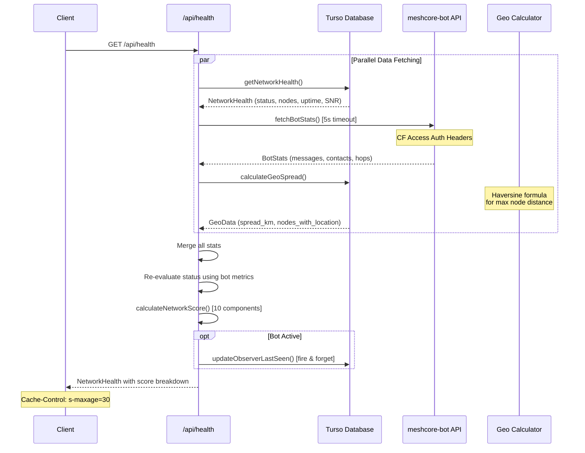

# Denver MeshCore API Reference

This document provides comprehensive documentation for the Denver MeshCore REST API endpoints.

## Base URL

All endpoints are relative to the application base URL (e.g., `https://denvermc.example.com`).

## API Endpoints

| Route | Method | Description | Cache TTL | Auth Required |
|-------|--------|-------------|-----------|---------------|
| `/api/health` | GET | Network health status and 10-component scoring | 30s | No |
| `/api/stats` | GET | Community-wide statistics with bot metrics | 60s | No |
| `/api/nodes` | GET | List all nodes with computed statistics | No cache | No |
| `/api/nodes/[id]` | GET | Single node details with packets and daily stats | No cache | No |

---

## Response Format

All API responses follow a consistent wrapper format:

```typescript
interface ApiResponse<T> {
  success: boolean;
  data?: T;
  error?: string;
}
```

---

## GET /api/health

Returns comprehensive network health status including a 10-component health scoring system.

### Sequence Diagram



### Request

```http
GET /api/health
```

### Response

```typescript
interface NetworkHealth {
  // Core status
  status: 'healthy' | 'degraded' | 'offline';
  uptime_pct: number;
  active_nodes: number;
  total_nodes: number;

  // Signal metrics
  avg_snr: number | null;
  avg_rssi: number | null;
  avg_noise_floor: number | null;

  // Error tracking
  total_errors: number;
  last_packet_at: string | null;

  // Bot metrics (from meshcore-bot API)
  contacts_24h?: number;
  contacts_7d?: number;
  messages_24h?: number;
  avg_hop_count?: number;
  max_hop_count?: number;
  bot_reply_rate?: number;
  unique_contributors?: number;

  // Geographic coverage
  geo_spread_km?: number;
  nodes_with_location?: number;

  // Performance
  avg_response_time_ms?: number;

  // Overall score (0-100)
  network_score?: number;
  score_breakdown?: ScoreBreakdown;
}
```

### Example Response

```json
{
  "success": true,
  "data": {
    "status": "healthy",
    "uptime_pct": 95,
    "active_nodes": 12,
    "total_nodes": 25,
    "avg_snr": 8.5,
    "avg_rssi": -95,
    "avg_noise_floor": -110,
    "total_errors": 3,
    "last_packet_at": "2024-01-15T10:30:00Z",
    "contacts_24h": 45,
    "contacts_7d": 180,
    "messages_24h": 523,
    "avg_hop_count": 2.3,
    "max_hop_count": 5,
    "bot_reply_rate": 94,
    "unique_contributors": 18,
    "geo_spread_km": 85.4,
    "nodes_with_location": 15,
    "avg_response_time_ms": 4500,
    "network_score": 72,
    "score_breakdown": {
      "status": 8,
      "uptime": 8,
      "signal": 6,
      "activity": 7,
      "responsiveness": 6,
      "reach": 6,
      "recency": 10,
      "diversity": 4,
      "geo_coverage": 8,
      "latency": 10
    }
  }
}
```

---

## Network Health Scoring System

The network score is calculated from **10 weighted components**, each worth 0-10 points (max 100 total).

### Score Components & Thresholds

| Component | Description | 10 Points | 8 Points | 6 Points | 4 Points | 2 Points |
|-----------|-------------|-----------|----------|----------|----------|----------|
| **Status** | Network health status | healthy + ≥10 nodes | healthy + ≥5 nodes | healthy | degraded (3) | - |
| **Uptime** | Bot reply rate / uptime % | ≥99% | ≥95% | ≥90% | ≥80% | ≥50% |
| **Signal** | Average SNR (dB) | ≥15 dB | ≥12 dB | ≥8 dB | ≥5 dB | ≥0 dB |
| **Activity** | Messages + contacts (log scale) | High activity | - | - | - | Low activity |
| **Responsiveness** | Bot reply rate 24h | ≥99% | ≥95% | ≥90% | ≥80% | ≥50% |
| **Reach** | Multi-hop network span | max ≥8 hops | max ≥6 hops | max ≥4 hops | avg ≥2.5 | avg ≥1.5 |
| **Recency** | Time since last packet | <1 min | <5 min | <15 min | <30 min | <60 min |
| **Diversity** | Unique active users | ≥50 users | ≥40 users | ≥30 users | ≥20 users | ≥10 users |
| **Geo Coverage** | Geographic spread | ≥150 km | ≥100 km | ≥60 km | ≥30 km | >0 km |
| **Latency** | Response time (LoRa) | <5s | <10s | <30s | <60s | >60s |

### Score Calculation Details

```typescript
interface ScoreBreakdown {
  status: number;        // 0-10: Network status + node count
  uptime: number;        // 0-10: System uptime percentage
  signal: number;        // 0-10: Signal-to-noise ratio quality
  activity: number;      // 0-10: Message and contact activity (log scale)
  responsiveness: number; // 0-10: Bot response rate
  reach: number;         // 0-10: Multi-hop network depth
  recency: number;       // 0-10: Freshness of last packet
  diversity: number;     // 0-10: Unique user count
  geo_coverage: number;  // 0-10: Geographic spread (km)
  latency: number;       // 0-10: Message response time
}
```

### Geographic Spread Calculation

The `geo_spread_km` metric uses the **Haversine formula** to calculate the maximum distance between any two nodes with GPS coordinates:

```typescript
function haversineDistance(lat1: number, lon1: number, lat2: number, lon2: number): number {
  const R = 6371; // Earth's radius in km
  const dLat = (lat2 - lat1) * Math.PI / 180;
  const dLon = (lon2 - lon1) * Math.PI / 180;
  const a = Math.sin(dLat / 2) ** 2 +
            Math.cos(lat1 * Math.PI / 180) * Math.cos(lat2 * Math.PI / 180) *
            Math.sin(dLon / 2) ** 2;
  return R * 2 * Math.atan2(Math.sqrt(a), Math.sqrt(1 - a));
}
```

**Goal**: Fort Collins to Colorado Springs coverage (~160 km).

---

## GET /api/stats

Returns community-wide statistics including bot interaction metrics.

### Request

```http
GET /api/stats
```

### Response

```typescript
interface CommunityStats {
  // Node counts
  active_nodes: number;
  total_nodes: number;

  // Packet counts
  packets_today: number;
  packets_total: number;

  // Signal quality
  avg_snr: number | null;

  // Bot metrics (from meshcore-bot API)
  contacts_24h?: number;
  contacts_7d?: number;
  messages_24h?: number;
  total_messages?: number;
  avg_hop_count?: number;
  max_hop_count?: number;
  bot_reply_rate_24h?: number;
  top_users?: Array<{ user: string; count: number }>;
}
```

### Example Response

```json
{
  "success": true,
  "data": {
    "active_nodes": 12,
    "total_nodes": 25,
    "packets_today": 1847,
    "packets_total": 156234,
    "avg_snr": 8.5,
    "contacts_24h": 45,
    "contacts_7d": 180,
    "messages_24h": 523,
    "total_messages": 12500,
    "avg_hop_count": 2.3,
    "max_hop_count": 5,
    "bot_reply_rate_24h": 94,
    "top_users": [
      { "user": "DenverHiker", "count": 45 },
      { "user": "MountainRelay", "count": 38 }
    ]
  }
}
```

---

## GET /api/nodes

Returns all nodes in the network with computed statistics.

### Request

```http
GET /api/nodes
```

### Response

```typescript
interface NodeWithStats {
  // Identity
  id: string;
  public_key: string;
  name: string | null;
  owner_discord_id: string | null;

  // Location
  latitude: number | null;
  longitude: number | null;

  // Classification
  node_type: 'node' | 'companion' | 'repeater' | 'room_server' | 'router' | 'gateway';

  // Hardware info
  model: string | null;
  hardware_version: string | null;
  firmware_version: string | null;
  client_version: string | null;
  radio_config: string | null;  // Format: "frequency,bandwidth,sf,power"

  // Live metrics
  battery_mv: number | null;
  noise_floor: number | null;
  uptime_secs: number | null;
  error_count: number | null;
  queue_len: number | null;
  tx_air_secs: number | null;
  rx_air_secs: number | null;

  // Timestamps
  created_at: string;
  last_seen: string | null;

  // Computed stats
  packets_today: number;
  packets_total: number;
  is_online: boolean;
}
```

### Example Response

```json
{
  "success": true,
  "data": [
    {
      "id": "abc12345",
      "public_key": "0x1234567890abcdef",
      "name": "Denver Peak Repeater",
      "owner_discord_id": "123456789",
      "latitude": 39.7392,
      "longitude": -104.9903,
      "node_type": "repeater",
      "model": "RAK4631",
      "hardware_version": "1.2",
      "firmware_version": "2.1.0",
      "client_version": "1.5.0",
      "radio_config": "906.875,250,10,22",
      "battery_mv": 4150,
      "noise_floor": -110,
      "uptime_secs": 345600,
      "error_count": 2,
      "queue_len": 0,
      "tx_air_secs": 1234,
      "rx_air_secs": 5678,
      "created_at": "2024-01-01T00:00:00Z",
      "last_seen": "2024-01-15T10:30:00Z",
      "packets_today": 156,
      "packets_total": 12500,
      "is_online": true
    }
  ]
}
```

---

## GET /api/nodes/[id]

Returns detailed information for a single node including recent packets and daily statistics.

### Request

```http
GET /api/nodes/{id}
```

| Parameter | Type | Description |
|-----------|------|-------------|
| `id` | string | Node ID (validated format) |

### Response

```typescript
interface NodeDetailResponse {
  node: Node;
  recent_packets: Packet[];    // Last 50 packets
  daily_stats: NodeStatsDaily[]; // Last 30 days
}

interface Packet {
  id: number;
  node_id: string | null;
  packet_type: string | null;
  raw_data: string | null;
  snr: number | null;
  rssi: number | null;
  hop_count: number | null;
  timestamp: string;
  origin_key: string | null;
  score: number | null;
  duration: number | null;
  route: string | null;
  len: number | null;
  payload_len: number | null;
  direction: 'rx' | 'tx' | null;
}

interface NodeStatsDaily {
  id: number;
  node_id: string | null;
  date: string;
  packets_rx: number;
  packets_tx: number;
  uptime_pct: number | null;
  avg_snr: number | null;
}
```

### Example Response

```json
{
  "success": true,
  "data": {
    "node": {
      "id": "abc12345",
      "public_key": "0x1234567890abcdef",
      "name": "Denver Peak Repeater",
      "node_type": "repeater",
      "last_seen": "2024-01-15T10:30:00Z"
    },
    "recent_packets": [
      {
        "id": 12345,
        "node_id": "abc12345",
        "packet_type": "TEXT",
        "snr": 10.5,
        "rssi": -92,
        "hop_count": 2,
        "timestamp": "2024-01-15T10:30:00Z",
        "direction": "rx"
      }
    ],
    "daily_stats": [
      {
        "id": 100,
        "node_id": "abc12345",
        "date": "2024-01-15",
        "packets_rx": 145,
        "packets_tx": 89,
        "uptime_pct": 99.5,
        "avg_snr": 9.2
      }
    ]
  }
}
```

---

## Error Handling

All endpoints return consistent error responses:

### HTTP Status Codes

| Code | Description |
|------|-------------|
| 200 | Success |
| 400 | Bad Request - Invalid parameters (e.g., malformed node ID) |
| 404 | Not Found - Resource does not exist |
| 500 | Internal Server Error - Database or external service failure |

### Error Response Format

```typescript
interface ErrorResponse {
  success: false;
  error: string;
}
```

### Example Error Responses

**400 Bad Request** (Invalid node ID):
```json
{
  "success": false,
  "error": "Invalid node ID format"
}
```

**404 Not Found**:
```json
{
  "success": false,
  "error": "Node not found"
}
```

**500 Internal Server Error**:
```json
{
  "success": false,
  "error": "Failed to fetch network health"
}
```

---

## Caching Strategy

### Server-Side Caching

| Endpoint | Next.js `revalidate` | Cache-Control Header |
|----------|---------------------|---------------------|
| `/api/health` | 30 seconds | `public, s-maxage=30, stale-while-revalidate=15` |
| `/api/stats` | 60 seconds | `public, s-maxage=60, stale-while-revalidate=30` |
| `/api/nodes` | None | None |
| `/api/nodes/[id]` | None | None |

### External API Timeouts

The meshcore-bot API calls have a **5-second timeout** to prevent blocking when the bot is offline. If the bot is unreachable, the API gracefully degrades and returns database-only metrics.

### Bot API Authentication

When `CF_ACCESS_CLIENT_ID` and `CF_ACCESS_CLIENT_SECRET` environment variables are configured, requests to the bot API include Cloudflare Access service token headers for authentication.

---

## Environment Variables

| Variable | Description | Required |
|----------|-------------|----------|
| `BOT_API_URL` | meshcore-bot statistics API endpoint | No |
| `CF_ACCESS_CLIENT_ID` | Cloudflare Access service token client ID | No |
| `CF_ACCESS_CLIENT_SECRET` | Cloudflare Access service token secret | No |

---

## Utility Types & Functions

The API uses several utility types and helper functions defined in `/src/lib/types.ts`:

### Radio Configuration

```typescript
interface RadioConfig {
  frequency: number;      // MHz (e.g., 906.875)
  bandwidth: number;      // kHz (e.g., 250)
  spreadingFactor: number; // SF (e.g., 10)
  power: number;          // dBm (e.g., 22)
}

// Parse from string format: "906.875,250,10,22"
function parseRadioConfig(config: string | null): RadioConfig | null;
```

### Battery Status

```typescript
// LiPo battery: 4200mV = 100%, 3200mV = 0%
function formatBatteryPercent(mV: number | null): number | null;
```

### Uptime Formatting

```typescript
// Convert seconds to human-readable: "4d 6h" or "45m"
function formatUptime(seconds: number | null): string;
```

---

## Node Types

| Type | Description |
|------|-------------|
| `node` | Standard mesh node |
| `companion` | Companion/client device |
| `repeater` | Packet repeater/relay |
| `room_server` | MeshCore room server |
| `router` | Network router |
| `gateway` | Internet gateway |
