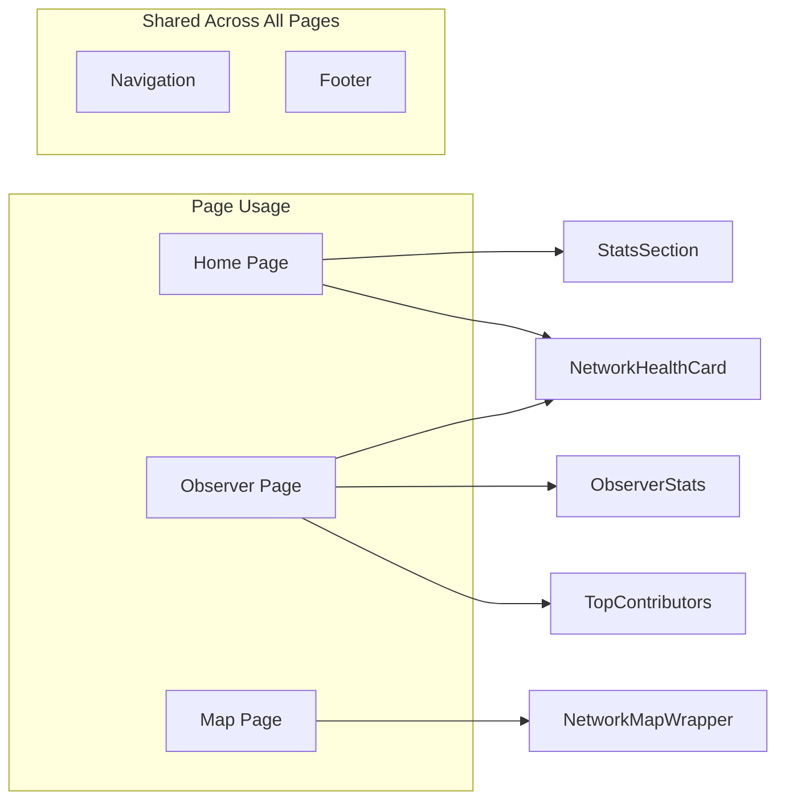

# Denver MeshCore Component Library

This document provides comprehensive documentation for the React component library used in the Denver MeshCore application.

## Component Hierarchy

```mermaid
graph TB
    subgraph Layout["Layout Components"]
        Navigation
        MobileMenu
        Footer
    end

    subgraph Core["Core Display Components"]
        NetworkHealthCard
        NetworkMapWrapper
        NetworkMap
        StatsSection
        ObserverStats
        TopContributors
    end

    subgraph Utility["Utility Components"]
        LoadingSkeleton
        ErrorState
        NotFound
        CopyButton
    end

    subgraph Hooks["Custom Hooks"]
        useStats
    end

    Navigation --> MobileMenu
    NetworkMapWrapper --> NetworkMap
    StatsSection --> useStats
    ObserverStats --> useStats
    TopContributors --> useStats
    NetworkHealthCard -.-> |fetches /api/health| API
    NetworkMap -.-> |fetches /api/nodes| API
    useStats -.-> |fetches /api/stats & /api/health| API

    style Layout fill:#1e3a5f,stroke:#0ea5e9
    style Core fill:#1e3a5f,stroke:#22c55e
    style Utility fill:#1e3a5f,stroke:#f59e0b
    style Hooks fill:#1e3a5f,stroke:#8b5cf6
```



## Component Relationships



---

## Core Components

### NetworkHealthCard

Displays real-time network health metrics with auto-refresh functionality.

**Location:** `src/components/NetworkHealthCard.tsx`

**Props Interface:**
```typescript
interface NetworkHealthCardProps {
  refreshInterval?: number; // Refresh interval in ms (default: 30000)
}
```

**Usage:**
```tsx
import { NetworkHealthCard } from '@/components';

// Basic usage with default 30-second refresh
<NetworkHealthCard />

// Custom refresh interval (10 seconds)
<NetworkHealthCard refreshInterval={10000} />
```

**Features:**
- Displays overall network status (Healthy/Degraded/Offline)
- Shows network score with color-coded indicators
- Displays average SNR with quality-based coloring
- Shows 24h metrics: contacts, messages, hop count, bot reply rate
- Signal metrics: RSSI, noise floor, last activity
- Score breakdown with visual progress bars
- Auto-refresh with configurable interval
- Loading skeleton and error states

---

### NetworkMap

Interactive Leaflet map displaying mesh network nodes with geolocation.

**Location:** `src/components/NetworkMap.tsx`

**Props Interface:**
```typescript
interface NetworkMapProps {
  nodes?: NodeWithStats[]; // Pre-loaded nodes (optional, fetches if not provided)
  className?: string;      // Additional CSS classes
}
```

**Usage:**
```tsx
import { NetworkMapWrapper } from '@/components';

// Auto-fetches nodes
<NetworkMapWrapper className="h-96" />

// With pre-loaded nodes
<NetworkMapWrapper nodes={nodeData} />
```

**Features:**
- Dark theme map tiles (CARTO)
- Color-coded markers by node type (companion, repeater, room_server)
- Online/offline visual indicators
- Popup with node details on click
- Auto-centers on Denver or fits bounds to nodes
- Node type legend
- Stats overlay showing node count

---

### NetworkMapWrapper

SSR-safe wrapper for NetworkMap using Next.js dynamic imports.

**Location:** `src/components/NetworkMapWrapper.tsx`

**Props Interface:**
```typescript
interface NetworkMapWrapperProps {
  nodes?: NodeWithStats[];
  className?: string;
}
```

**Usage:**
```tsx
import { NetworkMapWrapper } from '@/components';

<NetworkMapWrapper className="rounded-lg" />
```

**Why use this:** Leaflet requires `window` object and cannot be server-side rendered. This wrapper handles the dynamic import with a loading state.

---

### StatsSection

Homepage statistics section displaying key network metrics.

**Location:** `src/components/StatsSection.tsx`

**Props Interface:**
```typescript
// No props - uses useStats hook internally
```

**Usage:**
```tsx
import { StatsSection } from '@/components';

<StatsSection />
```

**Features:**
- 3-column grid layout (responsive)
- Active Contacts card with icon
- Messages card with 24h count
- Network Reach card with hop statistics
- Loading and error states
- Auto-refresh via useStats hook

---

### ObserverStats

Compact stats grid for the Observer page with health data.

**Location:** `src/components/ObserverStats.tsx`

**Props Interface:**
```typescript
interface ObserverStatsProps {
  refreshInterval?: number; // Refresh interval in ms (default: 30000)
}
```

**Usage:**
```tsx
import { ObserverStats } from '@/components';

<ObserverStats refreshInterval={15000} />
```

**Features:**
- 4-column responsive grid
- Active Contacts with weekly context
- Messages with total count
- Network Reach with hop stats
- Bot Reply Rate percentage
- Loading skeleton and error handling

---

### TopContributors

Displays top message senders with ranking and progress bars.

**Location:** `src/components/TopContributors.tsx`

**Props Interface:**
```typescript
interface TopContributorsProps {
  refreshInterval?: number; // Refresh interval in ms (default: 30000)
}
```

**Usage:**
```tsx
import { TopContributors } from '@/components';

<TopContributors refreshInterval={60000} />
```

**Features:**
- Ranked list of top 8 messagers
- Color-coded rank badges
- Progress bars showing relative contribution
- Total messages footer
- Loading and error states

---

## Layout Components

### Navigation

Main navigation header with responsive design.

**Location:** `src/components/Navigation.tsx`

**Props Interface:**
```typescript
// No props - default export
```

**Usage:**
```tsx
import Navigation from '@/components/Navigation';
// or
import { Navigation } from '@/components';

<Navigation />
```

**Features:**
- Fixed header with scroll-based transparency
- Mesh network logo with hover animation
- Centered navigation links
- Discord CTA button
- Mobile hamburger menu trigger
- Scroll-based backdrop blur effect

**Navigation Links:**
- Home (`/`)
- Map (`/map`)
- Observer (`/observer`)
- About (`/about`)
- Get Started (`/start`)

---

### MobileMenu

Slide-out mobile navigation menu.

**Location:** `src/components/MobileMenu.tsx`

**Props Interface:**
```typescript
interface NavLink {
  href: string;
  label: string;
  external?: boolean;
}

interface MobileMenuProps {
  isOpen: boolean;
  onClose: () => void;
  navLinks: NavLink[];
}
```

**Usage:**
```tsx
import MobileMenu from '@/components/MobileMenu';

<MobileMenu
  isOpen={isMobileMenuOpen}
  onClose={() => setIsMobileMenuOpen(false)}
  navLinks={navLinks}
/>
```

**Features:**
- Slide-in animation from right
- Backdrop with blur effect
- Focus trap for accessibility
- Escape key to close
- Discord CTA in footer
- Animated link stagger

---

### Footer

Site footer with navigation, community links, and resources.

**Location:** `src/components/Footer.tsx`

**Props Interface:**
```typescript
// No props - default export
```

**Usage:**
```tsx
import Footer from '@/components/Footer';
// or
import { Footer } from '@/components';

<Footer />
```

**Features:**
- Mountain silhouette SVG decoration
- Brand section with logo and description
- Quick Links column
- Community Links column (Discord, Observer)
- Resources column (LetsMesh, MeshCore)
- Dynamic copyright year
- Discord CTA button

---

## Utility Components

### LoadingSkeleton

Animated loading placeholder for content.

**Location:** `src/components/LoadingSkeleton.tsx`

**Props Interface:**
```typescript
interface LoadingSkeletonProps {
  variant?: 'node-detail' | 'default';
}
```

**Usage:**
```tsx
import { LoadingSkeleton } from '@/components';

// Default centered skeleton
<LoadingSkeleton />

// Node detail page skeleton
<LoadingSkeleton variant="node-detail" />
```

**Variants:**
- `default`: Centered loading bars
- `node-detail`: Full page layout matching NodeDetailPage structure

---

### ErrorState

Full-page error display with back navigation.

**Location:** `src/components/ErrorState.tsx`

**Props Interface:**
```typescript
interface ErrorStateProps {
  title?: string;    // Error title (default: 'Error')
  message: string;   // Error description (required)
  backHref?: string; // Back link URL (default: '/')
  backLabel?: string; // Back button text (default: 'Go Back')
}
```

**Usage:**
```tsx
import { ErrorState } from '@/components';

<ErrorState
  title="Connection Failed"
  message="Unable to connect to the mesh network. Please try again later."
  backHref="/observer"
  backLabel="Return to Observer"
/>
```

---

### NotFound

404-style not found page component.

**Location:** `src/components/NotFound.tsx`

**Props Interface:**
```typescript
interface NotFoundProps {
  title?: string;    // Title (default: 'Not Found')
  message?: string;  // Description (default: "The resource you're looking for...")
  backHref?: string; // Back link URL (default: '/')
  backLabel?: string; // Back button text (default: 'Go Back')
}
```

**Usage:**
```tsx
import { NotFound } from '@/components';

<NotFound
  title="Node Not Found"
  message="This node doesn't exist or may have been removed from the network."
  backHref="/nodes"
  backLabel="View All Nodes"
/>
```

---

### CopyButton

Clipboard copy button with visual feedback.

**Location:** `src/components/CopyButton.tsx`

**Props Interface:**
```typescript
interface CopyButtonProps {
  text: string;       // Text to copy to clipboard
  className?: string; // Additional CSS classes
}
```

**Usage:**
```tsx
import { CopyButton } from '@/components';

<CopyButton text={publicKey} className="ml-2" />
```

**Features:**
- Uses Clipboard API
- 2-second success checkmark animation
- Accessible aria-labels
- Hover state styling

---

## Custom Hooks

### useStats

Custom hook for fetching community stats and network health data.

**Location:** `src/hooks/useStats.ts`

**Interface:**
```typescript
interface UseStatsOptions {
  refreshInterval?: number;  // Auto-refresh interval in ms (default: 60000)
  includeHealth?: boolean;   // Also fetch health data (default: false)
}

interface UseStatsReturn {
  stats: CommunityStats | null;
  health: NetworkHealth | null;
  loading: boolean;
  error: string | null;
  lastUpdated: Date | null;
  refetch: () => Promise<void>;
}
```

**Usage:**
```tsx
import { useStats } from '@/hooks/useStats';

// Basic stats only
const { stats, loading, error } = useStats();

// With health data and custom interval
const { stats, health, loading, error, refetch } = useStats({
  refreshInterval: 30000,
  includeHealth: true,
});
```

**Features:**
- Auto-refresh with configurable interval
- Parallel fetching of stats and health when needed
- Error handling with retry capability
- Last updated timestamp
- SSR-compatible (client-only)

---

## Styling Notes

### TailwindCSS Patterns

The component library uses custom TailwindCSS utilities defined in the project:

**Color Palette:**
- `mesh` - Primary cyan accent (#0ea5e9)
- `mountain-500` - Purple mountain tones
- `forest-500` - Green nature tones
- `sunset-500` - Orange/amber tones
- `night-700/800/900` - Dark background shades
- `snow-100/300/400` - Light text shades
- `error` - Red error color

**Custom Classes:**
- `card-mesh` - Card component with mesh-themed styling
- `btn-accent` - Accent-colored button
- `btn-primary` - Primary action button
- `focus-ring` - Accessible focus indicator
- `bg-mountain-gradient` - Gradient background for hero sections
- `node-active` - Active node indicator styling

**Responsive Breakpoints:**
- `sm:` - 640px+
- `md:` - 768px+
- `lg:` - 1024px+

**Animation Classes:**
- `animate-pulse` - Loading pulse animation
- `animate-spin` - Spinner animation
- `transition-colors duration-200` - Color transitions
- `transition-transform duration-300` - Transform transitions

---

## Accessibility Considerations

All components follow WCAG 2.1 guidelines:

### Implemented Features

1. **Semantic HTML**
   - Proper heading hierarchy
   - `role` attributes for landmarks (`banner`, `navigation`, `contentinfo`)
   - `aria-label` for icon buttons
   - `aria-hidden="true"` for decorative icons

2. **Keyboard Navigation**
   - All interactive elements focusable
   - `focus-ring` class for visible focus indicators
   - Focus trap in MobileMenu
   - Escape key closes modals/menus

3. **Screen Reader Support**
   - Descriptive `aria-label` attributes
   - `aria-expanded` for toggle buttons
   - `aria-controls` linking buttons to controlled elements
   - `aria-modal="true"` for dialogs

4. **Color Contrast**
   - All text meets WCAG AA contrast requirements
   - Status indicators use both color and shape
   - Error states have distinct styling beyond color

5. **Motion**
   - Animations respect `prefers-reduced-motion`
   - Loading states use subtle pulse animations

### Best Practices for New Components

```tsx
// Button with proper accessibility
<button
  type="button"
  onClick={handleAction}
  className="focus-ring"
  aria-label="Descriptive action label"
  aria-expanded={isExpanded}
  aria-controls="controlled-element-id"
>
  <svg aria-hidden="true">...</svg>
  Visible Text
</button>

// Link with external indicator
<a
  href={externalUrl}
  target="_blank"
  rel="noopener noreferrer"
  className="focus-ring"
  aria-label="Link description (opens in new tab)"
>
  Link Text
  <svg aria-hidden="true" className="h-3 w-3">...</svg>
</a>
```

---

## Barrel Exports

All components are re-exported from `src/components/index.ts`:

```typescript
// Named exports
export { Navigation } from './Navigation';
export { MobileMenu } from './MobileMenu';
export { Footer } from './Footer';
export { StatsSection } from './StatsSection';
export { ObserverStats } from './ObserverStats';
export { NetworkHealthCard } from './NetworkHealthCard';
export { TopContributors } from './TopContributors';
export { CopyButton } from './CopyButton';
export { LoadingSkeleton } from './LoadingSkeleton';
export { NotFound } from './NotFound';
export { ErrorState } from './ErrorState';
export { NetworkMapWrapper } from './NetworkMapWrapper';
```

**Import Pattern:**
```tsx
// Import multiple components
import {
  Navigation,
  Footer,
  NetworkHealthCard,
  LoadingSkeleton
} from '@/components';
```
