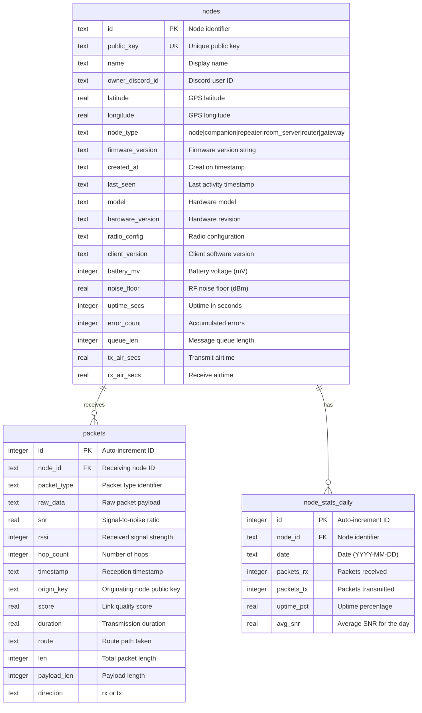

# Database Layer

This document describes the database layer for Denver MeshCore, including schema design, query functions, and usage examples.

## Overview

Denver MeshCore uses [Turso](https://turso.tech/) as its database provider, built on LibSQL (a fork of SQLite). The database layer provides:

- **Lazy initialization**: Database client is created on first access
- **Environment validation**: Required configuration is checked before queries
- **Type-safe queries**: Full TypeScript types for all database operations
- **Optimized queries**: CTEs and batch operations to minimize round trips

## Environment Variables

| Variable | Required | Description |
|----------|----------|-------------|
| `TURSO_DATABASE_URL` | Yes | Database connection URL (e.g., `libsql://your-database.turso.io`) |
| `TURSO_AUTH_TOKEN` | Recommended | Authentication token for production connections |

Example `.env.local`:
```bash
TURSO_DATABASE_URL=libsql://denvermc-your-org.turso.io
TURSO_AUTH_TOKEN=your-auth-token-here
```

## Entity Relationship Diagram



## Schema Reference

The database schema is defined in `schema.sql`:

### nodes

Stores registered mesh network nodes with hardware info and live status metrics.

| Column | Type | Description |
|--------|------|-------------|
| `id` | TEXT | Primary key, node identifier |
| `public_key` | TEXT | Unique cryptographic public key |
| `name` | TEXT | Human-readable node name |
| `owner_discord_id` | TEXT | Discord ID of the node owner |
| `latitude` | REAL | GPS latitude coordinate |
| `longitude` | REAL | GPS longitude coordinate |
| `node_type` | TEXT | Type: node, companion, repeater, room_server, router, gateway |
| `firmware_version` | TEXT | MeshCore firmware version |
| `created_at` | TEXT | ISO timestamp of registration |
| `last_seen` | TEXT | ISO timestamp of last activity |
| `model` | TEXT | Hardware model identifier |
| `hardware_version` | TEXT | Hardware revision |
| `radio_config` | TEXT | Radio configuration string |
| `client_version` | TEXT | Client software version |
| `battery_mv` | INTEGER | Battery voltage in millivolts |
| `noise_floor` | REAL | RF noise floor in dBm |
| `uptime_secs` | INTEGER | Uptime in seconds |
| `error_count` | INTEGER | Accumulated error count |
| `queue_len` | INTEGER | Message queue length |
| `tx_air_secs` | REAL | Cumulative TX airtime |
| `rx_air_secs` | REAL | Cumulative RX airtime |

### packets

Stores packet history from MQTT for analysis and statistics.

| Column | Type | Description |
|--------|------|-------------|
| `id` | INTEGER | Auto-increment primary key |
| `node_id` | TEXT | Foreign key to nodes table |
| `packet_type` | TEXT | Packet type identifier |
| `raw_data` | TEXT | Raw packet payload data |
| `snr` | REAL | Signal-to-noise ratio |
| `rssi` | INTEGER | Received signal strength indicator |
| `hop_count` | INTEGER | Number of mesh hops |
| `timestamp` | TEXT | ISO timestamp of receipt |
| `origin_key` | TEXT | Public key of originating node |
| `score` | REAL | Link quality score |
| `duration` | REAL | Transmission duration |
| `route` | TEXT | Route path taken |
| `len` | INTEGER | Total packet length |
| `payload_len` | INTEGER | Payload length |
| `direction` | TEXT | rx or tx |

### node_stats_daily

Stores daily aggregated statistics per node.

| Column | Type | Description |
|--------|------|-------------|
| `id` | INTEGER | Auto-increment primary key |
| `node_id` | TEXT | Foreign key to nodes table |
| `date` | TEXT | Date in YYYY-MM-DD format |
| `packets_rx` | INTEGER | Packets received that day |
| `packets_tx` | INTEGER | Packets transmitted that day |
| `uptime_pct` | REAL | Uptime percentage for the day |
| `avg_snr` | REAL | Average SNR for the day |

### Indexes

| Index | Table | Columns | Purpose |
|-------|-------|---------|---------|
| `idx_packets_timestamp` | packets | timestamp | Fast time-based queries |
| `idx_packets_node_id` | packets | node_id | Fast node filtering |
| `idx_nodes_last_seen` | nodes | last_seen | Fast online status queries |
| `idx_stats_node_date` | node_stats_daily | node_id, date | Fast stats lookup |

## Query Functions

### Database Client

```typescript
import { db, getDb } from '@/lib/db';

// Use the db proxy for simple queries
const result = await db.execute('SELECT * FROM nodes');

// Or get the raw client for advanced use
const client = getDb();
```

### Node Functions

#### `getAllNodes(): Promise<Node[]>`

Retrieve all nodes ordered by last seen timestamp.

```typescript
import { getAllNodes } from '@/lib/db';

const nodes = await getAllNodes();
// Returns: Node[] sorted by last_seen DESC
```

#### `getNodeById(id: string): Promise<Node | null>`

Retrieve a specific node by its ID.

```typescript
import { getNodeById } from '@/lib/db';

const node = await getNodeById('abc123');
if (node) {
  console.log(`Found node: ${node.name}`);
}
```

#### `getNodeByPublicKey(publicKey: string): Promise<Node | null>`

Retrieve a node by its public key.

```typescript
import { getNodeByPublicKey } from '@/lib/db';

const node = await getNodeByPublicKey('0x1234...');
```

#### `getNodesWithStats(): Promise<NodeWithStats[]>`

Retrieve all nodes with computed packet statistics and online status.

```typescript
import { getNodesWithStats } from '@/lib/db';

const nodes = await getNodesWithStats();
// Each node includes:
// - packets_today: number
// - packets_total: number
// - is_online: boolean
```

#### `upsertNode(node): Promise<void>`

Insert a new node or update an existing one.

```typescript
import { upsertNode } from '@/lib/db';

await upsertNode({
  id: 'node-123',
  public_key: '0xabc...',
  name: 'My Node',
  node_type: 'repeater',
  latitude: 39.7392,
  longitude: -104.9903,
});
```

#### `updateNodeLastSeen(id: string): Promise<void>`

Update a node's last_seen timestamp to the current time.

```typescript
import { updateNodeLastSeen } from '@/lib/db';

await updateNodeLastSeen('node-123');
```

### Packet Functions

#### `getRecentPackets(limit?: number): Promise<Packet[]>`

Retrieve recent packets ordered by timestamp.

```typescript
import { getRecentPackets } from '@/lib/db';

// Get last 100 packets (default)
const packets = await getRecentPackets();

// Get last 50 packets
const packets50 = await getRecentPackets(50);
```

#### `getPacketsByNodeId(nodeId: string, limit?: number): Promise<Packet[]>`

Retrieve packets for a specific node.

```typescript
import { getPacketsByNodeId } from '@/lib/db';

const nodePackets = await getPacketsByNodeId('node-123', 50);
```

#### `insertPacket(packet: CreatePacketInput): Promise<void>`

Insert a new packet record.

```typescript
import { insertPacket } from '@/lib/db';

await insertPacket({
  node_id: 'node-123',
  packet_type: 'TEXT',
  snr: 8.5,
  rssi: -85,
  hop_count: 2,
  origin_key: '0xdef...',
  direction: 'rx',
});
```

#### `getPacketCountToday(): Promise<number>`

Get the count of packets received today.

```typescript
import { getPacketCountToday } from '@/lib/db';

const todayCount = await getPacketCountToday();
console.log(`Packets today: ${todayCount}`);
```

#### `getPacketCountTotal(): Promise<number>`

Get the total count of all packets.

```typescript
import { getPacketCountTotal } from '@/lib/db';

const totalCount = await getPacketCountTotal();
```

### Stats Functions

#### `getCommunityStats(): Promise<CommunityStats>`

Get aggregated community-wide statistics in a single optimized query.

```typescript
import { getCommunityStats } from '@/lib/db';

const stats = await getCommunityStats();
// Returns:
// {
//   active_nodes: 12,
//   total_nodes: 25,
//   packets_today: 1543,
//   packets_total: 45678,
//   avg_snr: 7.5
// }
```

#### `getNetworkHealth(): Promise<NetworkHealth>`

Get comprehensive network health status including signal metrics and error tracking.

```typescript
import { getNetworkHealth } from '@/lib/db';

const health = await getNetworkHealth();
// Returns:
// {
//   status: 'healthy' | 'degraded' | 'offline',
//   uptime_pct: 85,
//   active_nodes: 12,
//   total_nodes: 25,
//   avg_snr: 7.5,
//   avg_rssi: -82.3,
//   avg_noise_floor: -115.2,
//   total_errors: 3,
//   last_packet_at: '2024-01-15T10:30:00.000Z'
// }
```

#### `getDailyStats(nodeId: string, days?: number): Promise<NodeStatsDaily[]>`

Get daily statistics for a specific node.

```typescript
import { getDailyStats } from '@/lib/db';

// Get last 7 days (default)
const stats = await getDailyStats('node-123');

// Get last 30 days
const monthStats = await getDailyStats('node-123', 30);
```

#### `upsertDailyStats(nodeId, date, stats): Promise<void>`

Insert or update daily statistics for a node.

```typescript
import { upsertDailyStats } from '@/lib/db';

await upsertDailyStats('node-123', '2024-01-15', {
  packets_rx: 150,
  packets_tx: 45,
  uptime_pct: 99.5,
  avg_snr: 8.2,
});
```

#### `incrementDailyPacketCount(nodeId, type?): Promise<void>`

Increment the packet count for today's statistics.

```typescript
import { incrementDailyPacketCount } from '@/lib/db';

// Increment RX count (default)
await incrementDailyPacketCount('node-123');

// Increment TX count
await incrementDailyPacketCount('node-123', 'tx');
```

## Usage Examples

### Fetching Dashboard Data

```typescript
import { getCommunityStats, getNetworkHealth, getNodesWithStats } from '@/lib/db';

async function getDashboardData() {
  const [stats, health, nodes] = await Promise.all([
    getCommunityStats(),
    getNetworkHealth(),
    getNodesWithStats(),
  ]);

  return {
    stats,
    health,
    nodes: nodes.filter(n => n.is_online),
  };
}
```

### Recording Incoming Packets

```typescript
import { insertPacket, updateNodeLastSeen, incrementDailyPacketCount } from '@/lib/db';

async function recordPacket(nodeId: string, packet: CreatePacketInput) {
  await Promise.all([
    insertPacket(packet),
    updateNodeLastSeen(nodeId),
    incrementDailyPacketCount(nodeId, packet.direction ?? 'rx'),
  ]);
}
```

### Health Status Logic

The `getNetworkHealth()` function determines status based on:

| Condition | Status |
|-----------|--------|
| No active nodes or no recent packets | `offline` |
| Less than 50% uptime OR more than 10 errors | `degraded` |
| Otherwise | `healthy` |

## Type Definitions

All database types are defined in `/src/lib/types.ts`:

- `Node` - Full node record with all hardware and status fields
- `Packet` - Packet record with signal metrics and routing info
- `NodeStatsDaily` - Daily aggregated statistics
- `NodeWithStats` - Node with computed packet counts and online status
- `CommunityStats` - Aggregated community metrics
- `NetworkHealth` - Network health status and metrics
- `CreatePacketInput` - Input type for creating packets

## Performance Considerations

1. **Lazy Initialization**: The database client is only created when first accessed
2. **CTE Queries**: Stats queries use CTEs to combine multiple aggregations into single queries
3. **Indexed Columns**: Queries leverage indexes on timestamp, node_id, and last_seen
4. **Batch Operations**: Use `Promise.all()` for independent parallel queries
